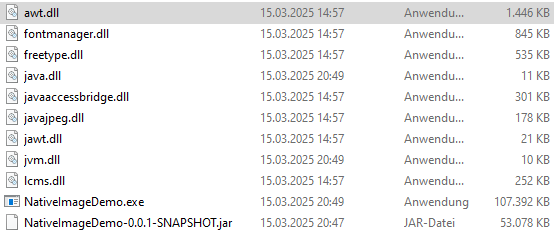

# Native Spring Boot Demo

## Setup for local build

- Install GraalVM 23
- For windows install Visual Studio C++ Compiler (see GraalVM Docs)
- For linux install gcc glibc-devel zlib-devel libstdc++-static
- run command `./mvnw -Pnative native:compile -DskipTests` to build native executable

### Image Sizes of different build approaches:

### Sizes of local executables

### Pro and Con

<ul style="color:greenyellow">
<li>smaller image size</li>
<li>faster container startup</li>
<li>less memory usage</li>
</ul>
<ul style="color:orangered">
<li>losing advantages of JVM and JIT-Compilation</li> 
</ul>